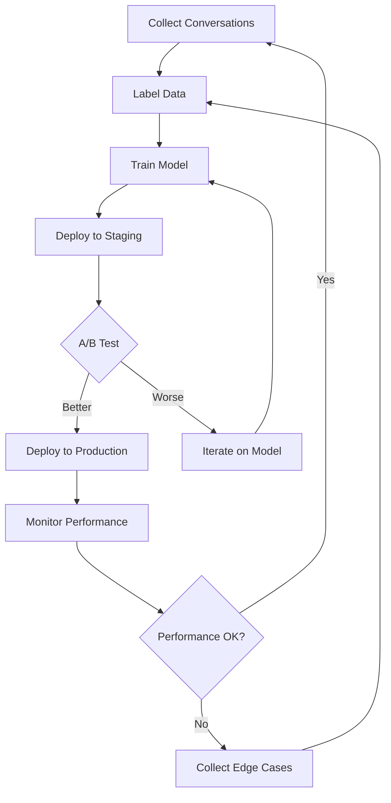

# ML Scalability Preparation Guide

## Preparing for 1K+ Customers/Month & Deep Learning

**Current Status**: Week 3 - Rule-based + Lightweight NLP  
**Target**: Month 6+ - Deep Learning Ready  
**Trigger**: 1,000+ conversations/month

---

## 📊 Data Collection Strategy

### **Phase 1: Months 1-3 (Current - 100 conversations/month)**

**What to collect:**

```python
# Add to every AI conversation
conversation_log = {
    "id": uuid4(),
    "timestamp": datetime.now(),
    "customer_id": customer_id,
    "messages": [
        {
            "role": "customer",
            "content": "Hey! I wanna book for 30 people",
            "detected_tone": "casual",
            "detected_intent": "booking_inquiry",
            "entities_extracted": {"CARDINAL": ["30"]},
            "confidence": 0.85
        },
        {
            "role": "ai",
            "content": "Awesome! For 30 guests...",
            "tone_used": "warm",
            "suggested_upsells": ["gyoza", "third_protein"]
        }
    ],
    "outcome": {
        "booked": True,
        "booking_id": "BK123",
        "total_value": 1950.00,
        "accepted_upsells": ["gyoza"]
    },
    "performance_metrics": {
        "response_time_ms": 85,
        "tone_accuracy": 0.85,
        "customer_satisfaction": None  # Add post-conversation survey
    }
}
```

**Storage**: PostgreSQL table `conversation_logs`

```sql
CREATE TABLE conversation_logs (
    id UUID PRIMARY KEY,
    timestamp TIMESTAMPTZ NOT NULL,
    customer_id INTEGER,
    conversation_data JSONB NOT NULL,
    outcome_data JSONB,
    metadata JSONB,
    created_at TIMESTAMPTZ DEFAULT NOW()
);

CREATE INDEX idx_conv_timestamp ON conversation_logs(timestamp);
CREATE INDEX idx_conv_outcome ON conversation_logs((outcome_data->>'booked'));
CREATE INDEX idx_conv_customer ON conversation_logs(customer_id);
```

**Action Items:**

- [ ] Add conversation logging to AI service (Week 4)
- [ ] Create analytics dashboard to track data growth (Week 5)
- [ ] Set up automated backups (Week 4)

---

### **Phase 2: Months 3-6 (500-1000 conversations/month)**

**Additional data points:**

1. **Customer Feedback Loop**

```python
# After each booking
post_conversation_survey = {
    "conversation_id": uuid,
    "questions": [
        {
            "q": "Did the AI understand you correctly?",
            "a": "yes/no",
            "rating": 5  # 1-5 stars
        },
        {
            "q": "Was the tone appropriate?",
            "a": "yes/no"
        },
        {
            "q": "Any confusion or errors?",
            "a": "free_text"
        }
    ]
}
```

2. **Edge Case Collection**

```python
# Flag conversations for review
edge_cases = {
    "low_confidence": confidence < 0.7,
    "no_entities_found": entities == {},
    "multiple_corrections": correction_count > 2,
    "escalated_to_human": True,
    "customer_expressed_frustration": sentiment == "negative"
}
```

3. **A/B Testing Data**

```python
# Compare rule-based vs NLP-enhanced
ab_test = {
    "variant": "nlp_enhanced",  # or "rule_based"
    "conversion_rate": 0.75,
    "avg_conversation_length": 5.2,
    "upsell_acceptance_rate": 0.45
}
```

---

## 🎯 ML Readiness Checklist

### **Trigger: When to Start ML Training**

| Metric                        | Current | Target for ML | Status          |
| ----------------------------- | ------- | ------------- | --------------- |
| Total conversations           | 0       | 10,000+       | ⏳ Collecting   |
| Labeled tone data             | 0       | 5,000+        | ⏳ Week 4 start |
| Booking outcomes              | 0       | 1,000+        | ⏳ Month 2      |
| Customer satisfaction surveys | 0       | 500+          | ⏳ Month 3      |
| Edge cases documented         | 0       | 200+          | ⏳ Month 2      |
| Monthly active users          | 0       | 1,000+        | ⏳ Month 6      |

**Automated Check Script:**

```python
# Run weekly to assess ML readiness
def check_ml_readiness():
    conversations = count_conversations()
    labeled_data = count_labeled_tone_data()
    bookings = count_bookings()

    if all([
        conversations >= 10000,
        labeled_data >= 5000,
        bookings >= 1000
    ]):
        alert_admin("🚀 ML READY! Time to consider deep learning models")
        generate_ml_report()
```

---

## 🔧 Infrastructure Preparation

### **Current Setup (CPU-only)**

```yaml
# docker-compose.yml
services:
  backend:
    image: myhibachi-ai:latest
    resources:
      limits:
        cpus: '2'
        memory: 4G
    environment:
      - USE_GPU=false
      - NLP_BACKEND=spacy # Lightweight
```

### **ML-Ready Setup (GPU-enabled)**

```yaml
# docker-compose.ml.yml (use when ready)
services:
  backend:
    image: myhibachi-ai:ml-enabled
    runtime: nvidia # GPU support
    resources:
      limits:
        cpus: '4'
        memory: 16G
      reservations:
        devices:
          - driver: nvidia
            count: 1
            capabilities: [gpu]
    environment:
      - USE_GPU=true
      - NLP_BACKEND=transformers # Deep learning
      - MODEL_SIZE=base # or 'large' if GPU powerful
```

**GPU Options:** | Provider | GPU Type | Monthly Cost | Best For |
|----------|----------|-------------|----------| | AWS EC2 g4dn.xlarge
| NVIDIA T4 | $380 | Production | | Google Cloud n1-highmem-4 + T4 |
NVIDIA T4 | $400 | Production | | Azure NC6 | NVIDIA K80 | $450 |
Development | | Paperspace | RTX 4000 | $500 | Development | | Lambda
Labs | RTX 3090 | $550 | Training |

**Cost Optimization:**

- Use spot instances (50-70% cheaper)
- Auto-scale: GPU only during business hours
- Use CPU inference for 90% of queries, GPU for complex cases

---

## 📦 ML Model Pipeline

### **Phase 3: Model Development (Month 6+)**

**Model 1: Advanced Tone Classifier**

```python
# Option A: Fine-tune BERT (requires GPU)
from transformers import BertForSequenceClassification, Trainer

model = BertForSequenceClassification.from_pretrained(
    'bert-base-uncased',
    num_labels=5  # formal, casual, anxious, warm, direct
)

# Train on your 5,000+ labeled conversations
trainer = Trainer(
    model=model,
    train_dataset=training_data,
    eval_dataset=validation_data
)
trainer.train()

# Expected accuracy: 90-95%
```

**Model 2: Intent Classification**

```python
# Classify customer intent
intents = [
    "booking_inquiry",
    "pricing_question",
    "menu_question",
    "scheduling_question",
    "complaint",
    "modification_request"
]

# Use distilbert (lighter, 40% faster than BERT)
from transformers import DistilBertForSequenceClassification
```

**Model 3: Upsell Prediction**

```python
# Predict which upsells will work
from sklearn.ensemble import GradientBoostingClassifier

features = [
    'party_size',
    'price_mentioned',
    'conversation_length',
    'time_on_site',
    'previous_bookings',
    'detected_tone',
    'time_of_day'
]

# Train on 1,000+ booking outcomes
model = GradientBoostingClassifier()
model.fit(X_train, y_train)

# Accuracy: 75-85%
```

---

## 🚀 Deployment Strategy

### **Option 1: Hybrid Approach (RECOMMENDED)**

```python
class HybridAIService:
    """
    Use lightweight NLP for 90% of cases
    Use deep learning for complex cases only
    """

    def process_message(self, message):
        # Try fast NLP first
        tone, confidence = self.nlp_service.detect_tone(message)

        if confidence > 0.8:
            # High confidence - use fast path
            return self.generate_response_rule_based(message, tone)
        else:
            # Low confidence - use ML model
            tone = self.ml_model.predict_tone(message)
            return self.generate_response_ml(message, tone)
```

**Benefits:**

- ✅ 90% of queries: <50ms (NLP)
- ✅ 10% of queries: <200ms (ML)
- ✅ Cost: 90% savings on GPU compute
- ✅ Fallback: If GPU fails, still works

### **Option 2: Full ML (When scale demands)**

```python
class FullMLService:
    """
    Use deep learning for everything
    Requires GPU, but highest accuracy
    """

    def __init__(self):
        self.tone_model = load_model('tone_classifier_bert')
        self.intent_model = load_model('intent_classifier_distilbert')
        self.upsell_model = load_model('upsell_predictor_xgboost')

    def process_message(self, message):
        # All inference on GPU
        tone = self.tone_model.predict(message)
        intent = self.intent_model.predict(message)
        entities = self.extract_entities_ml(message)

        return self.generate_response_ml(message, tone, intent, entities)
```

---

## 📈 Performance Monitoring

### **KPIs to Track (Weekly)**

```python
# metrics_tracker.py
class MLPerformanceTracker:
    def track_weekly_metrics(self):
        return {
            # Data Growth
            "conversations_this_week": count_new_conversations(),
            "total_conversations": count_all_conversations(),
            "labeled_data_percentage": calculate_labeled_percentage(),

            # Model Performance
            "tone_accuracy": calculate_tone_accuracy(),
            "intent_accuracy": calculate_intent_accuracy(),
            "response_time_p95": calculate_p95_latency(),

            # Business Metrics
            "conversion_rate": bookings / conversations,
            "upsell_acceptance_rate": upsells_accepted / upsells_offered,
            "avg_booking_value": sum(booking_values) / len(bookings),

            # ML Readiness
            "ml_ready": is_ml_ready(),
            "estimated_days_to_ml_ready": calculate_days_to_ready()
        }
```

### **Alerting Thresholds**

```python
# Set up alerts (Sentry, PagerDuty, email)
alerts = {
    "ml_data_ready": conversations >= 10000,
    "performance_degradation": tone_accuracy < 0.75,
    "high_latency": p95_latency > 200,
    "gpu_needed": conversations_per_day > 1000,
    "model_drift": accuracy_drop > 0.10  # Retrain needed
}
```

---

## 🔄 Continuous Improvement Loop



---

## 💰 Cost Projections

### **Current (Month 1-6): $50-100/month**

- CPU-only hosting
- Lightweight NLP (free)
- PostgreSQL (included)

### **ML Transition (Month 6-12): $500-800/month**

- GPU instance: $380/month
- Increased storage: $50/month
- Monitoring tools: $70/month
- Model training compute: Variable

### **Full Scale (Month 12+): $1,000-2,000/month**

- Multiple GPU instances: $800/month
- Auto-scaling: $300-500/month
- ML monitoring (Weights & Biases): $200/month
- Data storage: $100-200/month

**Break-even Analysis:**

- Need ~200 bookings/month at $550 each = $110K/month revenue
- ML costs: $2K/month = 1.8% of revenue
- **Profitable if conversion improves by >3%**

---

## 📝 Action Items (Next 6 Months)

### **Week 4 (THIS WEEK)**

- [x] Install spaCy + sentence-transformers
- [ ] Add conversation logging to database
- [ ] Test enhanced NLP service
- [ ] Monitor accuracy improvements

### **Month 2**

- [ ] Collect 100+ conversations with outcomes
- [ ] Implement customer satisfaction surveys
- [ ] Set up A/B testing framework
- [ ] Create ML readiness dashboard

### **Month 3**

- [ ] Collect 500+ conversations
- [ ] Start labeling tone data (hire labelers?)
- [ ] Document edge cases
- [ ] Evaluate ML frameworks (TensorFlow vs PyTorch)

### **Month 4-5**

- [ ] Collect 1,000+ conversations
- [ ] Train first experimental models
- [ ] Set up GPU development environment
- [ ] Benchmark rule-based vs ML performance

### **Month 6**

- [ ] Assess if 10K conversations reached
- [ ] Make GO/NO-GO decision on full ML
- [ ] If GO: Procure GPU infrastructure
- [ ] If NO: Continue with lightweight NLP

---

## 🎯 Success Criteria

**You're ready for deep learning when:**

- ✅ 10,000+ conversations collected
- ✅ 5,000+ labeled tone examples
- ✅ 1,000+ booking outcomes
- ✅ Lightweight NLP accuracy plateaus (<85%)
- ✅ Revenue supports $2K/month ML costs
- ✅ Team has ML engineering capability

**Stay with lightweight NLP if:**

- ⏳ <10,000 conversations
- ⏳ Current accuracy >80%
- ⏳ Budget constraints (<$500/month for AI)
- ⏳ No ML engineer on team

---

## 📚 Learning Resources

**For when you're ready to scale:**

- [Hugging Face Transformers Course](https://huggingface.co/course)
- [Fast.ai Practical Deep Learning](https://course.fast.ai/)
- [Made With ML - Production ML](https://madewithml.com/)
- [Stanford CS224N NLP](http://web.stanford.edu/class/cs224n/)

**Books:**

- "Natural Language Processing with Transformers" (2022)
- "Designing Machine Learning Systems" by Chip Huyen (2022)
- "Machine Learning Engineering" by Andriy Burkov (2020)

---

## 🤝 Support & Consultation

When you hit 1K customers/month and are ready to scale:

1. Review this document
2. Run ML readiness check
3. Evaluate ROI projections
4. Consider hiring ML engineer or consultant
5. Start with experimental models on staging

**Remember**: Your current system is excellent. Only add complexity
when data and scale demand it.
