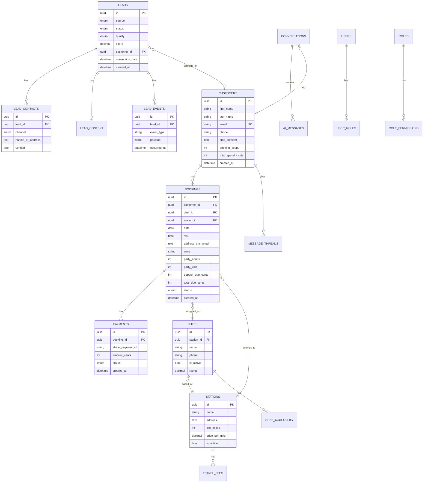

# My Hibachi – Entity Relationship Diagram (ERD)

**Last Updated:** December 16, 2025 **Purpose:** Visualize database
structure and relationships

---

## �️ Infrastructure

| Component         | Service            | Domain/Location          |
| ----------------- | ------------------ | ------------------------ |
| **Customer Site** | Vercel             | myhibachichef.com        |
| **Admin Panel**   | Vercel             | admin.mysticdatanode.net |
| **Backend API**   | Plesk VPS          | mhapi.mysticdatanode.net |
| **Database**      | PostgreSQL (Plesk) | localhost:5432 on VPS    |
| **Cache**         | Redis (Plesk)      | localhost:6379 on VPS    |
| **DNS**           | Cloudflare         | All domains              |

---

## �📊 Database Schema Overview

The My Hibachi database uses **PostgreSQL** with multiple schemas for
logical separation:

| Schema     | Purpose                | Key Tables                               |
| ---------- | ---------------------- | ---------------------------------------- |
| `core`     | Core business entities | bookings, customers, message_threads     |
| `crm`      | Customer relationship  | leads, campaigns, customer_segments      |
| `lead`     | Lead details           | lead_contacts, lead_context, lead_events |
| `ops`      | Operations             | chefs, chef_availability                 |
| `identity` | Auth & stations        | users, roles, stations, permissions      |
| `ai`       | AI conversations       | conversations, messages, knowledge       |
| `pricing`  | Dynamic pricing        | menu_items, addons, travel_fees          |
| `audit`    | Audit trail            | audit_logs, security_events              |

---

## 🗺️ ERD Diagram (Mermaid)



---

## 🔗 Key Relationships

### Customer → Booking (One-to-Many)

A customer can have multiple bookings over time.

```
customers.id ← bookings.customer_id
```

### Lead → Customer (One-to-One, Optional)

When a lead converts, they become linked to a customer record.

```
leads.customer_id → customers.id (nullable)
```

### Lead → Lead Events (One-to-Many)

Funnel tracking events for each lead.

```
leads.id ← lead_events.lead_id
```

### Booking → Chef (Many-to-One)

Each booking is assigned one chef.

```
bookings.chef_id → ops.chefs.id
```

### Booking → Station (Many-to-One)

Each booking belongs to a service station.

```
bookings.station_id → identity.stations.id
```

### Chef → Station (Many-to-One)

Chefs are based at a home station.

```
ops.chefs.station_id → identity.stations.id
```

---

## 📋 Schema Details

### Core Schema (`core`)

| Table             | Purpose               | Key Fields                      |
| ----------------- | --------------------- | ------------------------------- |
| `bookings`        | Event reservations    | date, slot, party size, pricing |
| `customers`       | Customer profiles     | name, email, phone, consent     |
| `message_threads` | Communication threads | channel, status                 |
| `messages`        | Individual messages   | content, sender, timestamp      |
| `reviews`         | Customer reviews      | rating, content, status         |

### CRM Schema (`crm`)

| Table               | Purpose               | Key Fields                     |
| ------------------- | --------------------- | ------------------------------ |
| `leads`             | Potential customers   | source, status, quality, score |
| `campaigns`         | Marketing campaigns   | channel, content, schedule     |
| `customer_segments` | Dynamic segments      | name, rules                    |
| `segment_rules`     | Segmentation criteria | field, operator, value         |

### Lead Schema (`lead`)

| Table               | Purpose                 | Key Fields                     |
| ------------------- | ----------------------- | ------------------------------ |
| `lead_contacts`     | Contact methods         | channel, handle, verified      |
| `lead_context`      | Event preferences       | party size, budget, dates      |
| `lead_events`       | Funnel tracking         | event_type, payload, timestamp |
| `social_accounts`   | Business social pages   | platform, account_id           |
| `social_identities` | Customer social handles | platform, handle               |

### Ops Schema (`ops`)

| Table               | Purpose        | Key Fields                   |
| ------------------- | -------------- | ---------------------------- |
| `chefs`             | Hibachi chefs  | name, phone, station, rating |
| `chef_availability` | Schedule slots | chef_id, date, available     |

### Identity Schema (`identity`)

| Table         | Purpose              | Key Fields                  |
| ------------- | -------------------- | --------------------------- |
| `users`       | System users         | email, password_hash, role  |
| `roles`       | RBAC roles           | name, tier, permissions     |
| `stations`    | Service locations    | name, address, travel rules |
| `permissions` | Granular permissions | resource, action            |

### Pricing Schema (`pricing`)

| Table               | Purpose          | Key Fields                   |
| ------------------- | ---------------- | ---------------------------- |
| `menu_items`        | Menu offerings   | name, category, price        |
| `addon_items`       | Premium upgrades | name, price_per_person       |
| `travel_fee_config` | Travel pricing   | station_id, free_miles, rate |

---

## 🔒 Data Integrity Rules

### Foreign Key Constraints

| Relationship       | On Delete | Reason                              |
| ------------------ | --------- | ----------------------------------- |
| booking → customer | RESTRICT  | Can't delete customer with bookings |
| booking → chef     | SET NULL  | Chef can be unassigned              |
| lead → customer    | SET NULL  | Lead history preserved              |
| lead_event → lead  | CASCADE   | Events deleted with lead            |
| payment → booking  | RESTRICT  | Payment history preserved           |

### Check Constraints

| Table      | Constraint                      | Rule                    |
| ---------- | ------------------------------- | ----------------------- |
| `bookings` | `check_party_adults_positive`   | party_adults > 0        |
| `bookings` | `check_party_kids_non_negative` | party_kids >= 0         |
| `bookings` | `check_deposit_non_negative`    | deposit_due_cents >= 0  |
| `bookings` | `check_total_gte_deposit`       | total >= deposit        |
| `leads`    | `check_lead_score_range`        | score BETWEEN 0 AND 100 |

### Unique Constraints

| Table       | Constraint                          | Fields                               |
| ----------- | ----------------------------------- | ------------------------------------ |
| `customers` | `uq_customers_email`                | email                                |
| `bookings`  | `idx_booking_date_slot_active`      | date, slot (partial - not cancelled) |
| `chefs`     | `ix_core_bookings_chef_slot_unique` | chef_id, date, slot                  |

---

## 🔗 Related Documents

- [Data Dictionary](../02-IMPLEMENTATION/DATA_DICTIONARY.md) -
  Field-level details
- [Data Flow](./DATA_FLOW.md) - How data moves through system
- [Architecture](./ARCHITECTURE.md) - System overview
