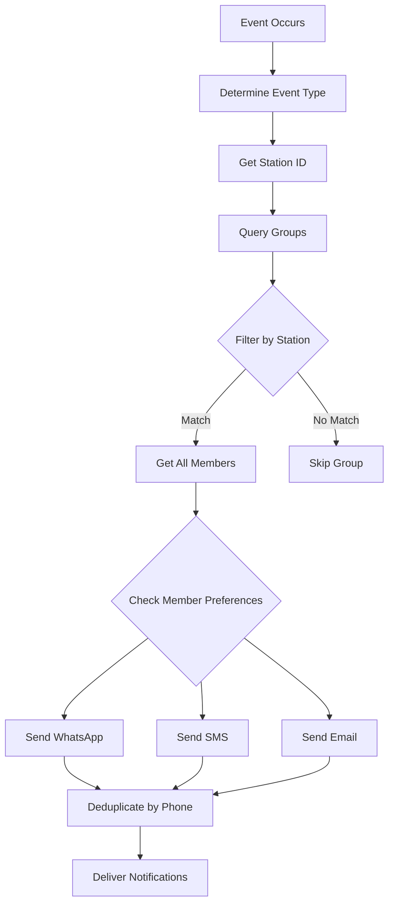

# 🎛️ Super Admin Notification Groups Management Guide

## Overview

This guide explains how to use the Super Admin panel to manage notification groups, add/remove team members, and configure which groups receive which notifications.

---

## 📋 Table of Contents

1. [Quick Start](#quick-start)
2. [Group Management](#group-management)
3. [Member Management](#member-management)
4. [Event Subscriptions](#event-subscriptions)
5. [Station-Based Filtering](#station-based-filtering)
6. [API Reference](#api-reference)
7. [Common Scenarios](#common-scenarios)

---

## Quick Start

### 1. Initialize Default Groups

Run this once after migration:

```bash
cd apps/backend
python initialize_notification_groups.py
```

This creates 5 default groups:
- **All Admins** - All events, all stations
- **Customer Service Team** - All events, all stations
- **Booking Management Team** - Booking events only
- **Payment Team** - Payment events only
- **Quality Assurance Team** - Reviews and complaints only

### 2. Create Station-Specific Groups

After creating stations in your database, run:

```bash
cd apps/backend
python create_station_groups.py
```

This automatically creates one notification group for **each active station**:
- **Station Managers - [Station Name]** - All station events for that specific station

Example groups created:
- "Station Managers - Sacramento" (only Sacramento bookings/payments)
- "Station Managers - Oakland" (only Oakland bookings/payments)
- "Station Managers - San Francisco" (only SF bookings/payments)

**To view station groups:**
```bash
python create_station_groups.py list
```

### 3. Add Team Members

Add members via API or admin panel (see [Member Management](#member-management) section).

**Example: Add station manager**
```bash
curl -X POST http://localhost:8000/api/admin/notification-groups/{station-group-id}/members \
  -H "Authorization: Bearer YOUR_TOKEN" \
  -H "Content-Type: application/json" \
  -d '{
    "phone_number": "+19167408768",
    "name": "Station Manager",
    "receive_whatsapp": true
  }'
```

### 4. Access the Admin Panel

```
https://your-domain.com/admin/notifications/groups
```

*Note: Only users with super_admin role can access this panel.*

---

## Group Management

### View All Groups

**API Endpoint:**
```http
GET /api/admin/notification-groups
```

**Example Response:**
```json
{
  "groups": [
    {
      "id": "uuid",
      "name": "All Admins",
      "description": "All administrators receive all notifications",
      "station_id": null,
      "is_active": true,
      "member_count": 5,
      "event_count": 7,
      "created_at": "2025-10-30T12:00:00Z"
    }
  ]
}
```

### Create New Group

**API Endpoint:**
```http
POST /api/admin/notification-groups
Content-Type: application/json

{
  "name": "Sacramento Station Managers",
  "description": "Station managers for Sacramento location",
  "station_id": "station-uuid-here",
  "is_active": true
}
```

**UI Actions:**
1. Click "Create New Group" button
2. Fill in group details:
   - **Name**: Unique group name
   - **Description**: What this group is for
   - **Station**: Select station (or leave blank for all stations)
   - **Active**: Enable/disable group
3. Click "Save"

### Update Group

**API Endpoint:**
```http
PATCH /api/admin/notification-groups/{group_id}
Content-Type: application/json

{
  "description": "Updated description",
  "is_active": false
}
```

**UI Actions:**
1. Click "Edit" button on group card
2. Modify fields
3. Click "Update"

### Delete Group

**API Endpoint:**
```http
DELETE /api/admin/notification-groups/{group_id}
```

**UI Actions:**
1. Click "Delete" button on group card
2. Confirm deletion
3. All members and event subscriptions are removed

⚠️ **Warning**: This action cannot be undone!

---

## Member Management

### Add Team Member to Group

**API Endpoint:**
```http
POST /api/admin/notification-groups/{group_id}/members
Content-Type: application/json

{
  "phone_number": "+19167408768",
  "name": "John Doe",
  "email": "john.doe@myhibachichef.com",
  "receive_whatsapp": true,
  "receive_sms": true,
  "receive_email": false,
  "priority": "high"
}
```

**UI Actions:**
1. Open group details
2. Click "Add Member" button
3. Fill in member details:
   - **Phone Number**: +1 format (required)
   - **Name**: Full name
   - **Email**: Optional
   - **Notification Preferences**:
     - ✅ WhatsApp
     - ✅ SMS
     - ☐ Email
   - **Priority**: High, Medium, or Low
4. Click "Add"

### View Group Members

**API Endpoint:**
```http
GET /api/admin/notification-groups/{group_id}/members
```

**Example Response:**
```json
{
  "members": [
    {
      "id": "uuid",
      "phone_number": "+19167408768",
      "name": "John Doe",
      "email": "john.doe@myhibachichef.com",
      "receive_whatsapp": true,
      "receive_sms": true,
      "receive_email": false,
      "priority": "high",
      "is_active": true,
      "added_at": "2025-10-30T12:00:00Z"
    }
  ]
}
```

### Update Member Preferences

**API Endpoint:**
```http
PATCH /api/admin/notification-groups/{group_id}/members/{member_id}
Content-Type: application/json

{
  "receive_whatsapp": false,
  "receive_sms": true,
  "priority": "medium"
}
```

**UI Actions:**
1. Click "Edit" on member card
2. Update preferences
3. Click "Save"

### Remove Member from Group

**API Endpoint:**
```http
DELETE /api/admin/notification-groups/{group_id}/members/{member_id}
```

**UI Actions:**
1. Click "Remove" button on member card
2. Confirm removal

---

## Event Subscriptions

### Available Event Types

| Event Type | Description |
|------------|-------------|
| `new_booking` | New booking created |
| `booking_edit` | Existing booking modified |
| `booking_cancellation` | Booking cancelled |
| `payment_received` | Payment confirmed |
| `review_received` | Customer review submitted |
| `complaint_received` | Customer complaint filed |
| `all` | Subscribe to all events |

### Add Event Subscription

**API Endpoint:**
```http
POST /api/admin/notification-groups/{group_id}/events
Content-Type: application/json

{
  "event_type": "new_booking"
}
```

**UI Actions:**
1. Open group details
2. Go to "Event Subscriptions" tab
3. Toggle event types on/off
4. Changes save automatically

### Remove Event Subscription

**API Endpoint:**
```http
DELETE /api/admin/notification-groups/{group_id}/events/{event_id}
```

**UI Actions:**
1. Open group details
2. Go to "Event Subscriptions" tab
3. Toggle event type off
4. Confirm removal

---

## Station-Based Filtering

### How It Works

Notification groups support station-based filtering to ensure teams only receive notifications for events at their assigned station.

**Two Types of Groups:**

1. **All-Stations Groups (station_id = null)**
   - Receive notifications from **ALL stations**
   - Perfect for corporate teams, super admins
   - Examples: "All Admins", "Customer Service Team"

2. **Station-Specific Groups (station_id = station-uuid)**
   - Receive notifications **ONLY from that specific station**
   - Perfect for station managers, local staff
   - Examples: "Station Managers - Sacramento", "Oakland Staff"

### Automatic Station Group Creation

The system **automatically** creates and manages notification groups for stations:

**🤖 Automatic Actions:**

1. **When you CREATE a station:**
   ```
   POST /api/admin/stations
   {
     "name": "Sacramento",
     "city": "Sacramento",
     "state": "CA",
     ...
   }
   
   ✅ Station created
   ✅ Notification group "Station Managers - Sacramento" auto-created
   ✅ Subscribed to all station events automatically
   ```

2. **When you UPDATE a station name/location:**
   ```
   PUT /api/admin/stations/{id}
   {
     "name": "Sacramento Downtown",  ← Name changed
     "city": "Sacramento",
     "state": "CA"
   }
   
   ✅ Station updated
   ✅ Notification group renamed to "Station Managers - Sacramento Downtown"
   ✅ Description updated with new location
   ```

3. **When you DEACTIVATE a station:**
   ```
   PUT /api/admin/stations/{id}
   {
     "status": "inactive"  ← Station deactivated
   }
   
   ✅ Station deactivated
   ✅ Notification group deactivated (members stop receiving notifications)
   ✅ Group preserved for reactivation
   ```

4. **When you DELETE a station:**
   ```
   DELETE /api/admin/stations/{id}
   
   ✅ Station deleted
   ✅ Notification group deleted (all members removed)
   ✅ Event subscriptions removed
   ```

**� Manual Script (Optional)**

If you need to create notification groups for existing stations (one-time bulk operation):

```bash
cd apps/backend
python create_station_groups.py
```

**This script is only needed for:**
- Migrating existing stations that were created before this feature
- Rebuilding groups if they were accidentally deleted
- Initial setup if automatic creation was disabled

**To view all station groups:**
```bash
python create_station_groups.py list
```

### Real-World Example

**Scenario**: New booking created at Sacramento station

1. **System Queries Groups:**
   ```sql
   SELECT * FROM notification_groups WHERE
     (station_id = 'sacramento-uuid' OR station_id IS NULL)
     AND is_active = true
   ```

2. **Groups Matched:**
   - ✅ "All Admins" (station_id = null) → Receives notification
   - ✅ "Station Managers - Sacramento" (station_id = sacramento-uuid) → Receives notification
   - ❌ "Station Managers - Oakland" (station_id = oakland-uuid) → Does NOT receive
   - ❌ "Station Managers - San Francisco" (station_id = sf-uuid) → Does NOT receive

3. **Notification Sent To:**
   - All members of "All Admins" group
   - All members of "Station Managers - Sacramento" group
   - System deduplicates if someone is in both groups

### Setting Station Filter

**When Creating Group:**
```json
{
  "name": "Oakland Station Team",
  "station_id": "oakland-station-uuid"
}
```

**When Updating Group:**
```json
PATCH /api/admin/notification-groups/{group_id}
{
  "station_id": "new-station-uuid"
}
```

**Remove Station Filter (receive from all stations):**
```json
PATCH /api/admin/notification-groups/{group_id}
{
  "station_id": null
}
```

### Use Cases

✅ **Station Managers** - Only receive notifications for their station
```json
{
  "name": "Sacramento Managers",
  "station_id": "sacramento-uuid",
  "event_types": ["new_booking", "booking_cancellation"]
}
```

✅ **Corporate Team** - Receive notifications from all stations
```json
{
  "name": "Corporate Team",
  "station_id": null,
  "event_types": ["all"]
}
```

---

## API Reference

### Authentication

All endpoints require:
```http
Authorization: Bearer <super-admin-jwt-token>
```

### Base URL

```
https://your-domain.com/api/admin/notification-groups
```

### Endpoints Summary

| Method | Endpoint | Description |
|--------|----------|-------------|
| `GET` | `/` | List all groups |
| `POST` | `/` | Create new group |
| `GET` | `/{id}` | Get group details |
| `PATCH` | `/{id}` | Update group |
| `DELETE` | `/{id}` | Delete group |
| `POST` | `/{id}/members` | Add member |
| `GET` | `/{id}/members` | List members |
| `PATCH` | `/{id}/members/{member_id}` | Update member |
| `DELETE` | `/{id}/members/{member_id}` | Remove member |
| `POST` | `/{id}/events` | Add event subscription |
| `DELETE` | `/{id}/events/{event_id}` | Remove event subscription |
| `POST` | `/initialize-defaults` | Create default groups |
| `GET` | `/event-types` | List available event types |

---

## Common Scenarios

### Scenario 1: New Station Opening

**Goal**: Set up notification groups for a new Sacramento location.

**Steps:**

**Option A: Automatic (Recommended)**
```bash
# After creating Sacramento station in database
cd apps/backend
python create_station_groups.py

# This automatically creates:
# - "Station Managers - Sacramento" group
# - Subscribes to: new_booking, booking_edit, booking_cancellation,
#                  payment_received, review_received, complaint_received
```

**Option B: Manual**

1. **Create Station Manager Group**
```http
POST /api/admin/notification-groups
{
  "name": "Station Managers - Sacramento",
  "description": "Managers for Sacramento location",
  "station_id": "sacramento-station-uuid"
}
```

2. **Add Station Managers**
```http
POST /api/admin/notification-groups/{group_id}/members
{
  "phone_number": "+19161234567",
  "name": "Alice Manager",
  "receive_whatsapp": true
}
```

3. **Subscribe to Relevant Events**
```http
POST /api/admin/notification-groups/{group_id}/events
{ "event_type": "new_booking" }

POST /api/admin/notification-groups/{group_id}/events
{ "event_type": "booking_edit" }

POST /api/admin/notification-groups/{group_id}/events
{ "event_type": "booking_cancellation" }

POST /api/admin/notification-groups/{group_id}/events
{ "event_type": "payment_received" }

POST /api/admin/notification-groups/{group_id}/events
{ "event_type": "review_received" }

POST /api/admin/notification-groups/{group_id}/events
{ "event_type": "complaint_received" }
```

**Result:**
- Sacramento managers receive notifications ONLY for Sacramento events
- Corporate "All Admins" group still receives notifications from ALL stations
- No duplicate notifications (system deduplicates by phone)

### Scenario 2: Team Member Changes Preferences

**Goal**: John prefers SMS over WhatsApp.

**Steps:**

```http
PATCH /api/admin/notification-groups/{group_id}/members/{john_id}
{
  "receive_whatsapp": false,
  "receive_sms": true,
  "receive_email": false
}
```

### Scenario 3: Temporary Disable Group

**Goal**: Disable notifications for a group during maintenance.

**Steps:**

```http
PATCH /api/admin/notification-groups/{group_id}
{
  "is_active": false
}
```

To re-enable:
```http
PATCH /api/admin/notification-groups/{group_id}
{
  "is_active": true
}
```

### Scenario 4: Create Specialized Team

**Goal**: Create a team that only handles payment issues.

**Steps:**

1. **Create Group**
```http
POST /api/admin/notification-groups
{
  "name": "Payment Specialists",
  "description": "Team handling payment issues and confirmations"
}
```

2. **Add Members**
```http
POST /api/admin/notification-groups/{group_id}/members
{
  "phone_number": "+19161234567",
  "name": "Payment Specialist 1",
  "receive_whatsapp": true,
  "priority": "high"
}
```

3. **Subscribe to Payment Events Only**
```http
POST /api/admin/notification-groups/{group_id}/events
{
  "event_type": "payment_received"
}
```

---

## Notification Flow

### How Notifications are Sent



### Example: New Booking at Sacramento Station

1. **Event**: New booking created at Sacramento station
2. **Groups Queried**:
   - "All Admins" (station_id = null) ✅
   - "Customer Service Team" (station_id = null) ✅
   - "Sacramento Station Managers" (station_id = sacramento-uuid) ✅
   - "Oakland Station Managers" (station_id = oakland-uuid) ❌
3. **Recipients**: All members from matching groups
4. **Deduplication**: Remove duplicate phone numbers
5. **Delivery**: Send via each member's preferred channels

---

## Best Practices

### 1. Group Organization

✅ **DO**:
- Create specific groups for different roles
- Use clear, descriptive names
- Document group purposes

❌ **DON'T**:
- Create too many overlapping groups
- Use vague names like "Team 1"
- Leave descriptions empty

### 2. Member Management

✅ **DO**:
- Keep member lists up to date
- Remove inactive members
- Respect member preferences

❌ **DON'T**:
- Add members without permission
- Ignore "Do Not Disturb" preferences
- Keep ex-employees in groups

### 3. Event Subscriptions

✅ **DO**:
- Subscribe groups to relevant events only
- Review subscriptions regularly
- Use "all" sparingly

❌ **DON'T**:
- Subscribe everyone to everything
- Ignore notification fatigue
- Forget to update after process changes

### 4. Station Filtering

✅ **DO**:
- Use station filters for station managers
- Keep corporate teams station-agnostic
- Test filters after setup

❌ **DON'T**:
- Filter groups that need all-station access
- Forget to update when stations change
- Leave station_id orphaned

---

## Troubleshooting

### Issue: Members Not Receiving Notifications

**Possible Causes:**
1. Group is inactive (`is_active = false`)
2. Member is inactive (`is_active = false`)
3. Event type not subscribed
4. Station filter mismatch
5. Phone number invalid
6. Twilio/WhatsApp credentials not configured

**Solution:**
```bash
# Check group status
GET /api/admin/notification-groups/{group_id}

# Check member status
GET /api/admin/notification-groups/{group_id}/members

# Verify event subscriptions
GET /api/admin/notification-groups/{group_id}
# Check "subscribed_events" array

# Test notification
POST /api/test/send-notification
{
  "phone_number": "+19161234567",
  "message": "Test notification"
}
```

### Issue: Duplicate Notifications

**Possible Causes:**
1. Member in multiple groups
2. Multiple event subscriptions
3. Station filter misconfigured

**Solution:**
- System automatically deduplicates by phone number
- If still occurring, check for duplicate phone numbers with different formats

### Issue: Wrong Group Receiving Notifications

**Possible Causes:**
1. Station filter incorrect
2. Event subscription wrong
3. Group not active

**Solution:**
```http
# Update station filter
PATCH /api/admin/notification-groups/{group_id}
{
  "station_id": "correct-station-uuid"
}

# Review event subscriptions
GET /api/admin/notification-groups/{group_id}
```

---

## Frontend Implementation

### React Component Example

```typescript
// NotificationGroupsPanel.tsx
import React from 'react';

interface Group {
  id: string;
  name: string;
  description: string;
  station_id: string | null;
  is_active: boolean;
  member_count: number;
  event_count: number;
}

const NotificationGroupsPanel: React.FC = () => {
  const [groups, setGroups] = React.useState<Group[]>([]);

  const fetchGroups = async () => {
    const response = await fetch('/api/admin/notification-groups', {
      headers: {
        'Authorization': `Bearer ${token}`
      }
    });
    const data = await response.json();
    setGroups(data.groups);
  };

  const createGroup = async (groupData: any) => {
    await fetch('/api/admin/notification-groups', {
      method: 'POST',
      headers: {
        'Content-Type': 'application/json',
        'Authorization': `Bearer ${token}`
      },
      body: JSON.stringify(groupData)
    });
    fetchGroups();
  };

  return (
    <div className="notification-groups-panel">
      <h1>Notification Groups</h1>
      
      <button onClick={() => setShowCreateModal(true)}>
        Create New Group
      </button>

      <div className="groups-grid">
        {groups.map(group => (
          <GroupCard key={group.id} group={group} />
        ))}
      </div>
    </div>
  );
};
```

---

## Security Considerations

### Role-Based Access Control

- **super_admin role ONLY** can access notification groups
- Regular admins cannot view or modify groups
- Station managers can only view their station's groups (future feature)

### Data Privacy

- Phone numbers are encrypted at rest
- Email addresses follow PII protection guidelines
- Member data is not exposed in public APIs

### Audit Logging

All actions are logged:
- Group creation/modification/deletion
- Member addition/removal
- Event subscription changes
- Notification deliveries

---

## Migration & Setup Checklist

- [ ] Run database migration: `alembic upgrade head`
- [ ] Initialize default groups: `python initialize_notification_groups.py`
- [ ] Register router in `main.py`
- [ ] Restart backend server
- [ ] Test API endpoints with Postman
- [ ] Add super_admin users to "All Admins" group
- [ ] Create station-specific groups
- [ ] Add team members to appropriate groups
- [ ] Configure event subscriptions
- [ ] Test notification delivery
- [ ] Deploy React frontend (optional)
- [ ] Document process for team
- [ ] Train super admins on usage

---

## Support

For technical support or feature requests:
- **Email**: dev@myhibachichef.com
- **Docs**: See `BACKEND_WHATSAPP_INTEGRATION_COMPLETE.md`
- **API Reference**: See `API_DOCUMENTATION.md`

---

**Last Updated**: October 30, 2025
**Version**: 1.0.0
**Status**: ✅ Production Ready
