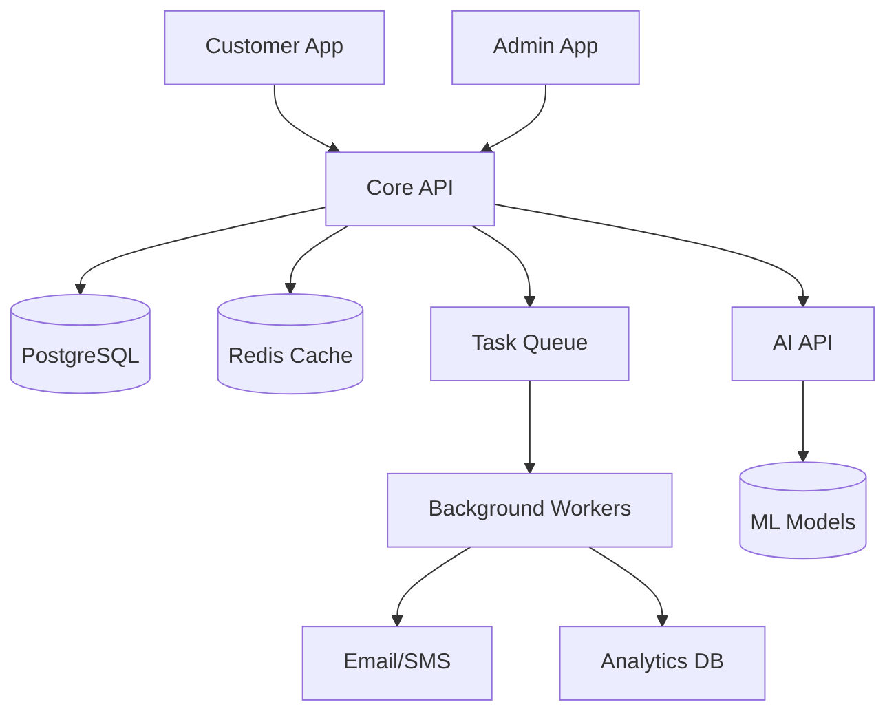

# 🏗️ MyHibachi - Enterprise Architecture

## System Architecture Overview

MyHibachi is built as a modern, scalable monorepo using industry best
practices for enterprise applications.

### 🎯 Architecture Principles

1. **Modular Design**: Clear separation of concerns with shared
   packages
2. **Type Safety**: End-to-end type safety from database to UI
3. **Scalability**: Horizontal and vertical scaling capabilities
4. **Security**: Zero-trust architecture with comprehensive security
   measures
5. **Observability**: Full system visibility with metrics, logs, and
   traces
6. **Developer Experience**: Fast feedback loops and comprehensive
   tooling

## 📁 Repository Structure

```
mh-project-/
├── apps/                           # Applications
│   ├── customer/                   # Customer-facing Next.js app
│   ├── admin/                      # Admin dashboard Next.js app
│   ├── api/                        # Core FastAPI backend
│   └── ai-api/                     # AI microservice (FastAPI)
├── packages/                       # Shared packages
│   ├── types/                      # Shared TypeScript types + Zod schemas
│   ├── api-client/                 # Generated API client from OpenAPI
│   ├── ui/                         # Shared React components
│   ├── utils/                      # Isomorphic utilities
│   ├── config/                     # Shared configuration
│   ├── tsconfig/                   # Shared TypeScript configurations
│   └── eslint-config/              # Shared ESLint configurations
├── infra/                          # Infrastructure as Code
│   ├── docker/                     # Docker configurations
│   ├── k8s/                        # Kubernetes manifests (future)
│   └── systemd/                    # Systemd service files
├── docs/                           # Documentation
│   ├── architecture.md             # This file
│   ├── runbooks/                   # Operational runbooks
│   └── adrs/                       # Architecture Decision Records
├── scripts/                        # Build and deployment scripts
├── e2e/                           # End-to-end tests
└── monitoring/                     # Monitoring configurations
```

## 🔧 Technology Stack

### Frontend Applications

- **Framework**: Next.js 15 with App Router
- **UI Library**: React 18 + Radix UI + Tailwind CSS
- **State Management**: React Query + Zustand
- **Forms**: React Hook Form + Zod validation
- **Payments**: Stripe, Zelle, Venmo integration
- **Testing**: Vitest + React Testing Library + Playwright

### Backend Services

- **API**: FastAPI with Pydantic v2
- **Database**: PostgreSQL with SQLAlchemy 2.0
- **Authentication**: JWT + OAuth 2.0
- **Caching**: Redis
- **Queue**: Celery + Redis
- **Testing**: Pytest + TestContainers

### Infrastructure

- **Deployment**: Docker + VPS/Cloud
- **CI/CD**: GitHub Actions with path filtering
- **Monitoring**: Prometheus + Grafana + OpenTelemetry
- **Logging**: Structured JSON logs
- **Security**: SAST/DAST scanning, dependency auditing

## 🏛️ Application Architecture

### 1. Customer App (`apps/customer`)

**Purpose**: Customer-facing booking interface

**Key Features**:

- Hibachi catering booking system
- Real-time availability checking
- Multi-payment provider support
- Mobile-responsive design
- SEO-optimized pages

**Architecture**:

- Next.js App Router with Server Components
- Static generation for marketing pages
- Dynamic rendering for booking flows
- Edge runtime for performance
- Incremental Static Regeneration (ISR)

### 2. Admin App (`apps/admin`)

**Purpose**: Business management dashboard

**Key Features**:

- Booking management and scheduling
- Customer relationship management
- Revenue analytics and reporting
- Menu and pricing management
- Staff management and permissions

**Architecture**:

- Next.js with client-side rendering
- Real-time updates via WebSockets
- Role-based access control
- Advanced data visualization

### 3. Core API (`apps/api`)

**Purpose**: Central business logic and data management

**Key Features**:

- RESTful API with OpenAPI documentation
- CQRS pattern with event sourcing
- Real-time notifications
- Multi-tenant architecture
- Comprehensive audit logging

**Architecture**:

```
┌─────────────────────────────────────┐
│            FastAPI App              │
├─────────────────────────────────────┤
│  🔄 CQRS Commands & Queries         │
│  📅 Booking Management              │
│  💳 Payment Processing              │
│  📧 Notification System             │
│  🔐 Authentication & Authorization  │
├─────────────────────────────────────┤
│        🗄️ PostgreSQL Database       │
│  - Transactional data               │
│  - Event store                      │
│  - Read projections                 │
└─────────────────────────────────────┘
```

### 4. AI API (`apps/ai-api`)

**Purpose**: AI-powered features and automation

**Key Features**:

- Smart booking recommendations
- Dynamic pricing optimization
- Customer support chatbot
- Demand forecasting
- Menu optimization

## 🔄 Data Flow Architecture



## 🔐 Security Architecture

### Authentication & Authorization

- **JWT tokens** with refresh rotation
- **OAuth 2.0** for third-party integrations
- **Role-based permissions** (Customer, Admin, Chef, Manager)
- **API rate limiting** per user/IP
- **CORS policies** for cross-origin requests

### Data Protection

- **Encryption at rest** for sensitive data
- **TLS 1.3** for data in transit
- **PII tokenization** for payment data
- **Audit logging** for all sensitive operations
- **Input validation** with Pydantic/Zod schemas

### Infrastructure Security

- **Container scanning** with Trivy
- **Dependency auditing** with Snyk
- **Secret management** with encrypted storage
- **Network isolation** with VPC/security groups
- **Regular security updates** automated

## 📊 Observability Strategy

### Metrics Collection

- **Application metrics**: Business KPIs, response times, error rates
- **Infrastructure metrics**: CPU, memory, disk, network usage
- **Custom metrics**: Booking conversion rates, revenue per customer

### Logging Strategy

- **Structured JSON logs** with correlation IDs
- **Centralized aggregation** with ELK stack
- **Log levels**: DEBUG, INFO, WARN, ERROR, CRITICAL
- **Retention policies**: 30 days hot, 1 year cold storage

### Distributed Tracing

- **OpenTelemetry** integration across services
- **Request correlation** across service boundaries
- **Performance profiling** for optimization
- **Error tracking** with stack traces

### Alerting & Monitoring

- **Uptime monitoring** with health checks
- **Performance alerts** for SLA violations
- **Error rate thresholds** for early detection
- **Business metric alerts** for anomalies

## 🚀 Deployment Architecture

### Development Environment

```
Developer Workstation
├── Docker Compose
│   ├── PostgreSQL (local)
│   ├── Redis (local)
│   └── API services
├── Next.js dev servers
└── Hot reloading enabled
```

### Production Environment

```
Load Balancer (Nginx/Cloudflare)
├── Customer App (Vercel/Static)
├── Admin App (Vercel/Static)
└── API Services (VPS/Cloud)
    ├── FastAPI (Gunicorn + Uvicorn)
    ├── PostgreSQL (Managed DB)
    ├── Redis (Managed Cache)
    └── Background Workers
```

### CI/CD Pipeline

1. **Code Push** → Trigger GitHub Actions
2. **Path Detection** → Determine changed services
3. **Parallel Build** → Build only affected services
4. **Quality Gates** → Lint, test, security scan
5. **Container Build** → Multi-platform Docker images
6. **Deployment** → Rolling deployment with health checks
7. **Verification** → Automated smoke tests

## 🎯 Performance Targets

### Frontend Performance

- **First Contentful Paint**: < 1.5s
- **Largest Contentful Paint**: < 2.5s
- **Cumulative Layout Shift**: < 0.1
- **First Input Delay**: < 100ms
- **Core Web Vitals**: All green

### Backend Performance

- **API Response Time**: 95th percentile < 500ms
- **Database Query Time**: 95th percentile < 100ms
- **Availability**: 99.9% uptime SLA
- **Throughput**: 1000+ requests/second
- **Concurrent Users**: 10,000+

### Scalability Metrics

- **Horizontal Scaling**: Auto-scaling based on load
- **Database Scaling**: Read replicas for query distribution
- **Cache Hit Rate**: > 90% for frequently accessed data
- **CDN Usage**: > 95% static asset delivery via CDN

## 🔧 Development Workflow

### 1. Code Organization

- **Monorepo structure** with clear boundaries
- **Shared packages** for common functionality
- **Type-safe contracts** between services
- **Automated code generation** from schemas

### 2. Quality Assurance

- **Pre-commit hooks** for code formatting
- **Automated testing** at multiple levels
- **Code review** requirements for all changes
- **Security scanning** on every commit

### 3. Deployment Process

- **Feature branches** for new development
- **Pull request** workflow with reviews
- **Automated testing** in CI pipeline
- **Blue-green deployment** for zero downtime

This architecture ensures MyHibachi can scale from a small local
business to a multi-location enterprise while maintaining high
performance, security, and reliability.
